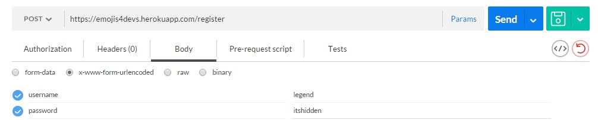
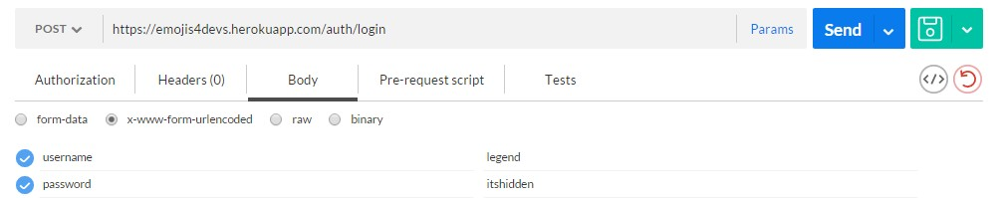
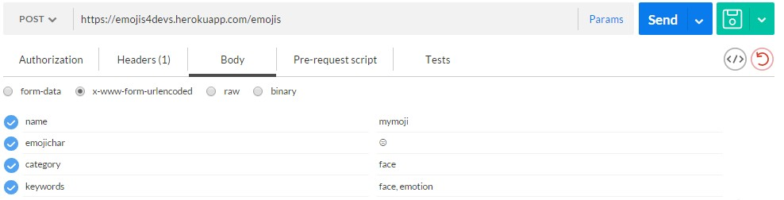

# Emojis4Devs REST API

Emojis4Devs is a RESTful API that allows you **get**, **find**, **update** or **delete** any emoji of your choosing. The API employs the use of simple token based authentication.

##Usage

Working on a client project or on a side project? There are many fun stuff you can do with Emojis4Devs e.g. All examples are shown in POSTMAN.

**First thing you have to do is to register. So hit the register route like so:**

Supply a `username` and a `password` and you are good to go.

**Next thing you want to do is to login: do that by hitting the /auth/login route**

**To have a listing of all the created emojis, you need to hit the `emojis` endpoint.**

**Create a new emoji**

See full documentation [here](https://emojis4devs.herokuapp.com/) for the various endpoints and how to consume them.

##Contributing
This is an open-source project, so please feel free to tell family and friends to contribute to Emojis4Devs to make it even more awesome. [**see how**](https://github.com/andela-fokosun/Checkpoint3/wiki/Contributing)

**Happy Coding!**
